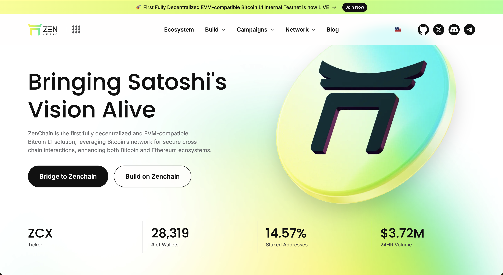

## ZENCHAIN



ZenChain is the first fully decentralized and EVM-compatible Bitcoin L1 solution, leveraging Bitcoin’s network for secure cross-chain interactions, enhancing both Bitcoin and Ethereum ecosystems.


## Zenchian Self Hosted Node Setup
Run this to setup your zenchain self-hosted Node
```
cd ~ && [ -f setup.sh ] && rm setup.sh; wget https://raw.githubusercontent.com/Rambeboy/zenchain-node-guide/refs/heads/master/setup.sh && sudo chmod +x setup.sh && ./setup.sh || echo "Error: Failed to install from setup.sh"
```

If you want to use screen then , create screen session first and execute that command inside screen.

